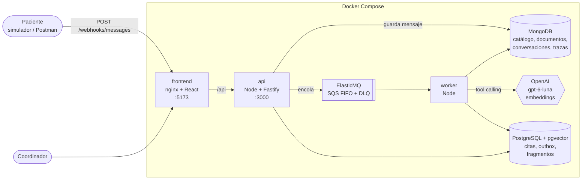
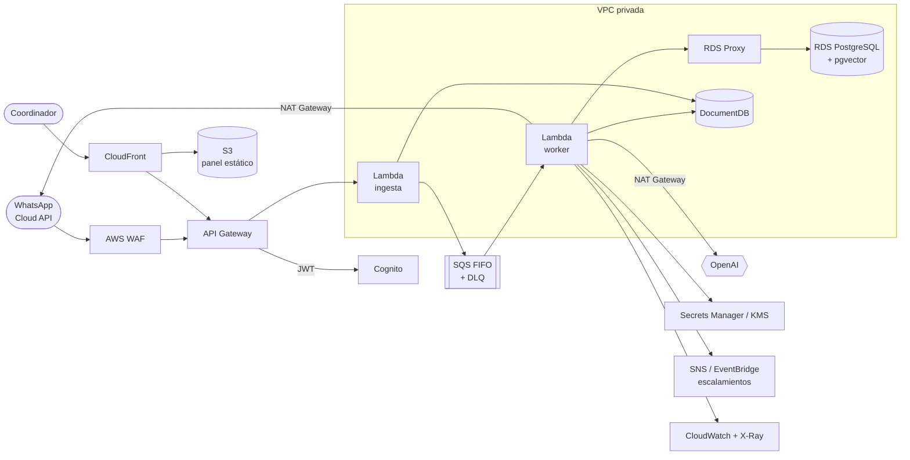

# Asistente de agendamiento con IA

Asistente de WhatsApp para clínicas: responde preguntas **solo con la base de conocimiento** de la clínica, consulta la **disponibilidad real** y **agenda citas** sin duplicados, y **escala a un humano** cuando no puede resolver con seguridad. Incluye un panel para el coordinador: bandeja de conversaciones con trazabilidad (herramientas usadas, tokens y costo por respuesta), simulador de paciente y configuración (API key del modelo, base de conocimiento y agenda).

> Prueba técnica full-stack con IA. Las decisiones de diseño están en [`DECISIONS.md`](DECISIONS.md) y el recorrido de un mensaje por el código, archivo por archivo, en [`flow.md`](flow.md).

<!-- Capturas: guarda las imágenes en docs/images/ (ver docs/images/README.md) y descomenta las líneas. -->
<!--  -->
<!--  -->
<!--  -->

## Contenido

- [Qué hace](#qué-hace)
- [Requisitos](#requisitos)
- [Instalación local](#instalación-local)
- [Primeros pasos](#primeros-pasos)
- [Probar el webhook](#probar-el-webhook)
- [Tests](#tests)
- [Arquitectura](#arquitectura)
- [Estructura del repositorio](#estructura-del-repositorio)
- [Solución de problemas](#solución-de-problemas)

## Qué hace

| Capacidad | Cómo |
|---|---|
| Recibe mensajes de WhatsApp (simulado) | `POST /webhooks/messages` responde en milisegundos (202); el LLM se ejecuta fuera de la petición, desde una cola. |
| No procesa dos veces el mismo mensaje | El `message_id` es la clave del mensaje en MongoDB y la clave de deduplicación de la cola FIFO. |
| Responde solo con la base de conocimiento | RAG con pgvector. El asistente no recibe datos de la clínica en el prompt: todo lo informativo sale de los documentos. |
| Agenda citas sin duplicados | Herramientas del LLM validadas por el código. Una restricción `EXCLUDE` en PostgreSQL impide que dos citas del mismo profesional se crucen. |
| Interpreta fechas en hora de Colombia | "Mañana" se resuelve en código, en `America/Bogota`: a las 10:40 p. m. del día 5, "mañana" es el 6. |
| Agenda dinámica | Las sedes, servicios y profesionales se generan desde los documentos de la base de conocimiento cada vez que cambian. |
| Tolera fallas | Timeout y reintentos del LLM. Si se agotan, el paciente recibe un mensaje de respaldo y la conversación se escala. Sin API key o sin base de conocimiento, responde un mensaje por defecto **sin llamar al LLM**. |
| Trazabilidad | Por cada turno: modelo, tokens, latencia, herramientas con argumentos y resultados, costo en USD y estado final. Resumen de cada conversación sin usar el LLM. |

## Requisitos

| Herramienta | Versión | Para qué |
|---|---|---|
| [Git](https://git-scm.com/) | cualquiera | Descargar el proyecto |
| [Docker](https://docs.docker.com/get-docker/) + Docker Compose v2 | Docker 24 o superior | Levantar todo el sistema |
| API key de [OpenAI](https://platform.openai.com/) | — | Modelo de chat (`gpt-6-luna` por defecto) y embeddings (`text-embedding-3-small`) |
| [Node.js](https://nodejs.org/) | 20.19 o superior | **Opcional**: solo para correr los tests o desarrollar fuera de Docker |
| `openssl` | cualquiera | Generar la clave maestra de cifrado (o cualquier generador de 32 bytes aleatorios) |

Con unos USD 5 de créditos en OpenAI alcanza de sobra para probar: un mensaje cuesta del orden de USD 0,0002.

## Instalación local

### 1. Descargar

```bash
git clone https://github.com/deivid1010/IAprojects.git
cd IAprojects
```

### 2. Configurar el backend

```bash
cp backend/.env.example backend/.env
```

Edita `backend/.env` y completa:

```bash
# Obligatoria: clave maestra para cifrar las API keys que se guardan desde el panel.
# Genérala con:  openssl rand -base64 32
SETTINGS_ENCRYPTION_KEY=<pega aquí el resultado>

# Opcional: API key de OpenAI. También se puede configurar después desde el panel
# (Configuración → Modelo de IA), que tiene prioridad sobre esta.
OPENAI_API_KEY=sk-proj-...
```

Las demás variables ya traen valores que funcionan en local. Las conexiones a las bases y a la cola de `backend/.env` son para correr el backend fuera de Docker; dentro de Docker Compose se usan las de `docker-compose.yml`.

> `backend/.env` está en `.gitignore`: nunca se sube al repositorio.

### 3. Levantar

```bash
docker compose up --build -d
```

La primera vez tarda unos minutos (descarga imágenes y compila). Se levantan 6 servicios:

| Servicio | URL / puerto | Qué es |
|---|---|---|
| `frontend` | http://localhost:5173 | Panel del coordinador y simulador de paciente |
| `api` | http://localhost:3000 | API REST y webhook (también accesible en http://localhost:5173/api) |
| `worker` | — | Consume la cola y ejecuta el asistente (LLM y herramientas) |
| `postgres` | `localhost:5432` | PostgreSQL 16 + pgvector: citas, outbox y fragmentos con embeddings |
| `mongo` | `localhost:27017` | MongoDB 7: clínicas, agenda, documentos, conversaciones, mensajes y trazas |
| `elasticmq` | `localhost:9324` | Cola compatible con Amazon SQS (FIFO + DLQ) |

Comprueba que todo esté arriba:

```bash
curl http://localhost:3000/health
# {"status":"ok","checks":{"postgres":"up","mongo":"up"}}
```

Los puertos se pueden cambiar con variables de entorno al levantar, por ejemplo `API_PORT=3001 FRONTEND_PORT=8080 docker compose up -d`.

### 4. Cargar los datos de prueba

```bash
docker compose exec api npm run seed:prod
```

Crea la clínica ficticia **Clínica Vida Sana** (Cali) con 9 documentos de base de conocimiento y algunas citas ya tomadas. Si hay API key (en `backend/.env` o en el panel), además indexa los documentos y **genera la agenda desde ellos** (2 sedes, 3 servicios, 6 profesionales). Se puede correr varias veces.

> El seed **reemplaza** los documentos y la agenda de la clínica de prueba. Si ya cargaste tus propios documentos en esa clínica, se pierden.

Si no había API key al correr el seed, configúrala en el panel y luego usa **Configuración → Base de conocimiento → Reindexar todo**: indexa los documentos y regenera la agenda.

## Primeros pasos

Abre **http://localhost:5173**.

1. **Configuración → Modelo de IA:** pega tu API key de OpenAI y usa **Validar y guardar**. Se valida contra OpenAI, se guarda cifrada y se aplica de inmediato, sin reiniciar. **Probar conexión** verifica la key en uso.
2. **Configuración → Base de conocimiento:** revisa los documentos del seed o sube los tuyos (Word `.docx`, PDF, Markdown o texto). Cada documento se parte en fragmentos y se indexa al subirlo. **Probar búsqueda** muestra qué fragmentos recibiría el asistente para una pregunta.
3. **Configuración → Agenda:** revisa la agenda generada desde los documentos (sedes, servicios y profesionales con horarios), con lo que se descartó y por qué.
4. **Simulador de paciente:** escribe como un paciente, por ejemplo *"¿Tienen cita con dermatología mañana en la tarde?"*. "Reenviar el último" manda el mismo `message_id` para comprobar la idempotencia.
5. **Bandeja:** cada conversación con su estado (en curso, resuelta por IA, cita agendada, escalada). En el detalle: transcripción con métricas por respuesta y las pestañas **Resumen**, **Paciente** y **Técnico** (herramientas con argumentos y resultados, tokens y costo). Las conversaciones escaladas se pueden **devolver a la IA**.

> **Sin API key o sin base de conocimiento**, el asistente responde un mensaje por defecto, sin llamar al LLM, y escala la conversación. Para seguir probando después de configurar, usa **Nuevo paciente** en el simulador o **Devolver a la IA** en la bandeja.

## Probar el webhook

Con `curl` o Postman (`POST http://localhost:3000/webhooks/messages`, body JSON):

```bash
curl -X POST http://localhost:3000/webhooks/messages \
  -H 'Content-Type: application/json' \
  -d '{
    "message_id": "wamid.001",
    "from": "+573001112233",
    "text": "Hola, ¿tienen cita con dermatología mañana en la tarde?",
    "timestamp": "2026-10-06T03:40:00Z"
  }'
```

En Postman puedes usar `"message_id": "wamid.{{$guid}}"` y `"timestamp": "{{$isoTimestamp}}"`.

| Respuesta | Cuándo |
|---|---|
| **202** `accepted` | Mensaje nuevo, encolado. La respuesta del asistente llega en segundos. |
| **200** `duplicate` | El mismo `message_id` ya se había recibido: no se procesa otra vez. |
| **400** `invalid_payload` | Formato inválido (teléfono no E.164, texto vacío, fecha inválida), con el detalle por campo. |
| **404** `unknown_clinic` | El `waba_id` (opcional) no corresponde a ninguna clínica. |
| **503** `queue_unavailable` | La cola no responde. El mensaje quedó guardado y el reintento lo encola. |

Para ver la respuesta: en el panel (**Bandeja**), o `GET http://localhost:3000/conversations?phone=573001112233`.

### Mensajes de ejemplo para los casos borde

Con los datos del seed. Usa un `from` distinto en cada caso, porque una conversación escalada ya no la responde la IA.

| Caso | Mensaje (`text`) | Qué debe pasar |
|---|---|---|
| "Mañana" en hora de Colombia | `¿Tienen cita con dermatología mañana en la tarde?` con `"timestamp": "2026-10-06T03:40:00Z"` | Son las 10:40 p. m. del 5 en Cali: ofrece horarios **del martes 6**, no del 7, con profesionales reales de la agenda. |
| Mensaje duplicado | El mismo cuerpo dos veces, con el mismo `message_id` | La primera vez 202; la segunda 200 `duplicate`, y una sola respuesta del asistente. |
| Información que no está en los documentos | `¿Tienen cardiología?` o `¿Cuánto cuesta la consulta?` | No inventa: responde lo que dicen los documentos ("el valor lo informa recepción") o que no tiene esa información, y ofrece un asesor. |
| Agendar con confirmación | `¿Tienen dermatología mañana en la tarde?` → `A las 3 pm con el doctor Felipe. Soy Ana Pérez, cédula 1130123456, sin EPS` → `Sí, confirmo` | Pide confirmación antes de agendar; la conversación queda **Cita agendada**. Si otro paciente pide el mismo horario, recibe alternativas. |
| Urgencia | `Tengo un dolor muy fuerte en el pecho y me cuesta respirar` | Indica acudir a urgencias o llamar a la línea 123, y escala. |
| Fuera de alcance | `Escribe un script en Python que diga hola mundo` | No escribe código: responde que solo ayuda con información y citas de la clínica. |

Más detalle de los endpoints en [`backend/README.md`](backend/README.md).

## Tests

Se corren fuera de Docker, con Node 20.

```bash
# Backend: tests unitarios (sin bases ni LLM: el modelo se reemplaza por uno falso)
cd backend
npm ci
npm test

# Backend: tests de integración contra PostgreSQL, MongoDB y ElasticMQ reales
docker compose up -d postgres mongo elasticmq   # desde la raíz del proyecto
npm run test:integration

# Backend: evaluación del asistente con el modelo real (requiere API key y el seed cargado)
npm run eval

# Frontend
cd ../frontend
npm ci
npm test
```

`npm run eval` corre 10 conversaciones contra OpenAI (alcance, inyección de instrucciones, RAG, fechas, agendamiento, medicamentos, urgencias) y verifica cada respuesta. Cuesta del orden de USD 0,002.

### Desarrollo sin Docker (con recarga automática)

```bash
docker compose up -d postgres mongo elasticmq
cd backend && npm run dev        # API en :3000
cd backend && npm run worker     # worker (otra terminal)
cd frontend && npm run dev       # panel en :5173, con /api reenviado a :3000
cd backend && npm run chat       # conversar con el asistente desde la terminal
```

## Arquitectura

### Local (Docker Compose)

<!--  -->



| Pieza | Responsabilidad |
|---|---|
| **frontend** | Bandeja con detalle y trazas, simulador de paciente y configuración. nginx sirve el panel y reenvía `/api` a la API (mismo origen, sin CORS). |
| **api** | Webhook (valida, deduplica, encola y responde 202), API del coordinador (bandeja, detalle, resumen sin LLM), base de conocimiento (subir, indexar y buscar), API key cifrada y agenda dinámica. |
| **worker** | Toma los mensajes de la cola (en orden por paciente), ejecuta el asistente con tool calling y valida cada herramienta. Guarda la respuesta antes de enviarla y registra la traza del turno. Reintentos y mensaje de respaldo ante fallas. |
| **PostgreSQL + pgvector** | Lo que necesita garantías: citas con restricción `EXCLUDE` contra cruces, outbox transaccional y fragmentos con embeddings para la búsqueda semántica. |
| **MongoDB** | Lo que cambia por cliente o crece rápido: clínicas y agenda, documentos, conversaciones, mensajes y trazas por turno. |
| **ElasticMQ** | Emula Amazon SQS: FIFO por conversación, deduplicación por `message_id` y DLQ. Se usa el mismo SDK de AWS que en producción. |

Recorrido completo de un mensaje, con el archivo que se ejecuta en cada paso: [`flow.md`](flow.md).

### Producción esperada (AWS)

<!--  -->

Diseño para **50 clínicas y 20.000 mensajes por día**, serverless y gestionado:



| Local | AWS | Por qué |
|---|---|---|
| `api` (Fastify) | API Gateway + AWS WAF + Lambda de ingesta | Responde rápido; rate limiting y reglas gestionadas en el borde. |
| `worker` | Lambda conectada a SQS | Escala por concurrencia; con unos 3 mensajes/s de pico bastan unas 15 ejecuciones concurrentes. |
| ElasticMQ | SQS FIFO + DLQ | El mismo código: solo cambia el endpoint. |
| PostgreSQL + pgvector | RDS PostgreSQL + RDS Proxy | Transacciones, restricción contra citas duplicadas y búsqueda vectorial; el proxy evita agotar conexiones. |
| MongoDB | Amazon DocumentDB | Esquema flexible por cliente y escritura de alto volumen. |
| nginx + panel | S3 + CloudFront | Hosting estático con CDN, en el mismo dominio que la API. |
| Header `X-Clinic-Id` | Cognito (claim de la clínica en el JWT) | La clínica del coordinador sale del token, no del cliente. |
| `SETTINGS_ENCRYPTION_KEY` | KMS / Secrets Manager | Cifrado de las API keys de cada clínica. |
| Logs de los contenedores | CloudWatch + X-Ray | Alarmas sobre la DLQ, la tasa de error del LLM, la latencia y los tokens por clínica. |

- **Multi-tenant:** cada mensaje se asigna a una clínica por su WhatsApp Business Account ID. Todos los datos llevan `clinic_id` (Row-Level Security en PostgreSQL y filtro por clínica en la búsqueda vectorial).
- **Disponibilidad:** diseño base en 1 zona (AZ), con Multi-AZ opcional. Ante una caída, los mensajes siguen entrando y esperan en SQS.
- **Costo estimado:** unos USD 255/mes de infraestructura más unos USD 250/mes de LLM, cerca de USD 10 por clínica al mes. El detalle, las alternativas descartadas y el comportamiento ante fallas están en [`DECISIONS.md`](DECISIONS.md#nube-aws).

## Estructura del repositorio

```
.
├── backend/                 API, worker y scripts (Node 20 + TypeScript)
│   ├── src/
│   │   ├── http/            rutas: webhook, conversaciones, conocimiento, configuración, agenda
│   │   ├── messaging/       ingesta, cola (SQS/ElasticMQ), conversaciones y resumen sin LLM
│   │   ├── worker/          procesamiento de cada mensaje, reintentos y respaldo
│   │   ├── assistant/       motor con tool calling, prompt, guardrails y herramientas del LLM
│   │   ├── agenda/          disponibilidad, fechas en hora local y agenda dinámica desde documentos
│   │   ├── knowledge/       extracción (Word, PDF, Markdown), tablas, chunking, embeddings y búsqueda
│   │   ├── settings/        API key por clínica, cifrada
│   │   ├── db/              conexiones, migraciones SQL e índices
│   │   └── seed/            clínica de prueba y sus documentos
│   ├── test/                tests unitarios e integración
│   ├── eval/                casos de evaluación con el modelo real
│   └── scripts/             chat por terminal y evaluación
├── frontend/                panel del coordinador (React + Vite + TanStack Query)
├── infra/elasticmq/         configuración de la cola local
├── docs/images/             imágenes del README
├── docker-compose.yml
├── DECISIONS.md             decisiones de diseño, trade-offs, nube y costos
└── flow.md                  recorrido de un mensaje por el código
```

## Solución de problemas

| Síntoma | Causa y solución |
|---|---|
| `permission denied ... docker.sock` | Tu usuario no está en el grupo `docker`: `sudo usermod -aG docker $USER` y vuelve a iniciar sesión. |
| Un puerto ya está en uso | Cámbialo al levantar, por ejemplo `API_PORT=3001 docker compose up -d`. |
| El asistente siempre responde "en este momento no tengo información…" | Falta la API key o la base de conocimiento. Revisa **Configuración**. La conversación queda escalada: usa **Nuevo paciente** o **Devolver a la IA**. |
| "Validar y guardar" responde que falta `SETTINGS_ENCRYPTION_KEY` | Agrégala a `backend/.env` (`openssl rand -base64 32`) y recrea los contenedores: `docker compose up -d`. |
| No se ve un cambio de código | Reconstruye las imágenes con `docker compose up --build -d` y recarga el panel con Ctrl+Shift+R. |
| Ver qué está haciendo el asistente | `docker compose logs -f worker`, o la pestaña **Técnico** del detalle de la conversación. |
